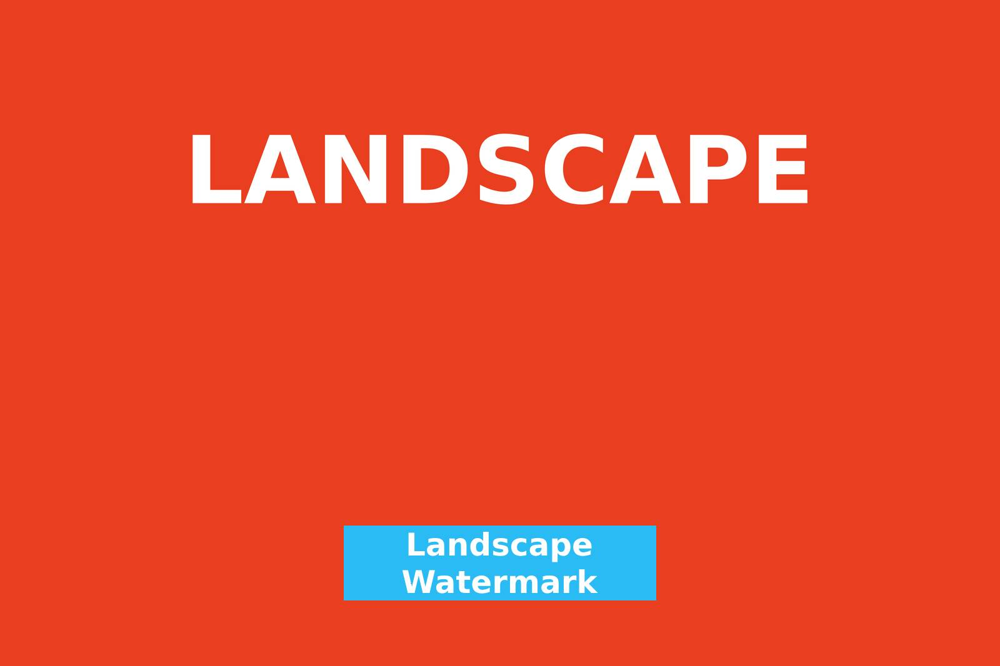
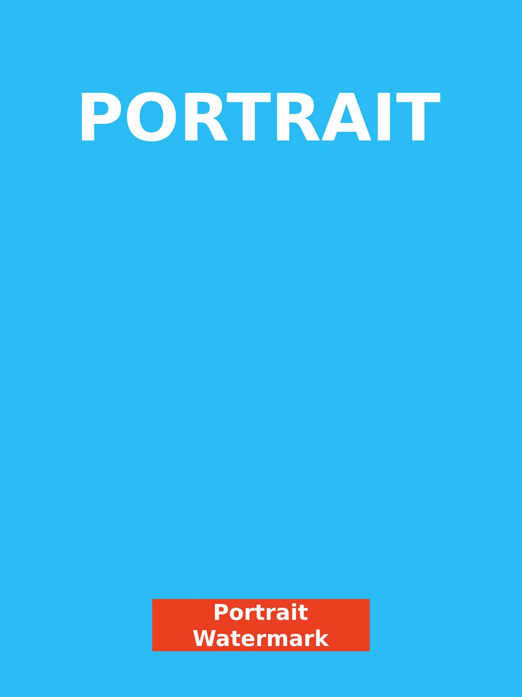

# 🖼️ Image Resizer & Watermarker

Simple Python script to batch resize images and add a watermark automatically.

- 📐 Landscape images: resized to **1600px width**
- 📐 Portrait images: resized to **1600px height**
- 🖼️ Adds centered watermark, 105px from the bottom
- 🔁 Automatically chooses watermark file based on image orientation
- 💾 Saves as `.jpg` with fixed quality (default: 70%)

🛠️ Script generated with help from ChatGPT
📦 Fully offline, no internet required

---

## 📦 Features

- Preserve aspect ratio while resizing
- Supports JPG, JPEG, and PNG as input
- Watermark image remains unscaled
- Supports batch processing (entire folder)

---

## ⚙️ Requirements

- Python **3.8+**
- [`Pillow`](https://pypi.org/project/Pillow/) (for image processing)

### 🧰 (Mac/Linux) Setup Virtual Environment *(Recommended)*

```bash
# Create virtual environment
python3 -m venv venv
source venv/bin/activate

# Install dependencies
pip install pillow
```

## 📂 Folder Structure

```
image-resizer-watermarker/
├── input-images/                  # Put your original images here (.jpg/.png)
├── output/                        # Script will save results here
├── assets/                        # Sample preview images for README
│   ├── input-landscape.jpg
│   ├── input-portrait.jpg
│   ├── output-landscape.jpg
│   └── output-portrait.jpg
├── landscape-watermark.png        # For landscape images
├── vertical-watermark.png         # For portrait images
└── script.py                      # The main Python script
```

## ▶️ How to Run

```
python script.py
```

## 🖼️ Example Input & Output

| Original Image | Processed Image |
|----------------|-----------------|
|  |  |
|  |  |

## 🔧 Customization

You can modify script.py to:

- Change watermark position or bottom offset
- Adjust output quality (quality=70)
- Add support for other formats (e.g., WebP)
- Skip resizing or watermark conditionally

## 📜 License

MIT — free to use, modify, and distribute.
